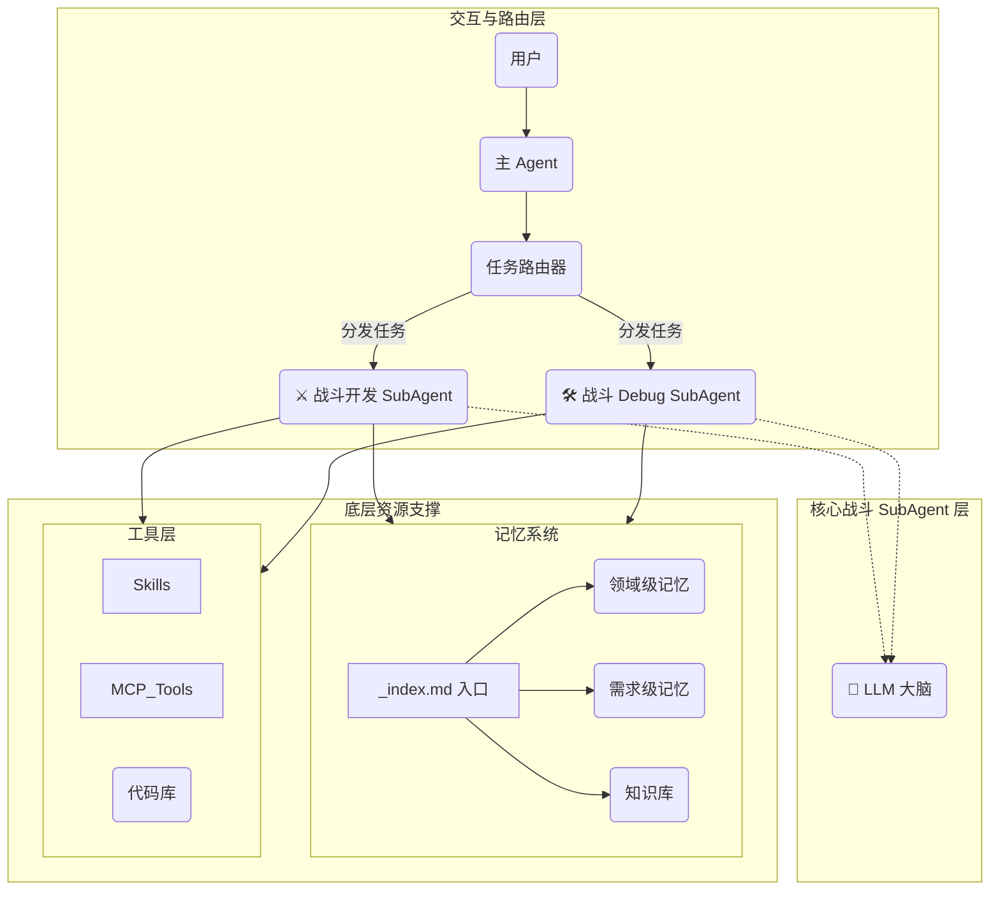

# 核心项目复盘 (Key Projects Review)

## 1. 战斗逻辑扩展与编辑器工具优化
**关键词**：`业务逻辑开发` `编辑器改造` `ECA化`

### 背景 (Situation)
- 现有战斗框架需要支持更多具体的业务逻辑以满足策划日益复杂的需求。
- Able 技能编辑器原有工作流效率较低，需要进行 ECA（Event-Condition-Action）化改造以提升配置灵活性。

### 任务 (Task)
- 在现有框架基础上，开发具体的 Condition（条件）和 Targeting（目标选择）业务节点。
- 执行 Able 编辑器的 ECA 化改造任务。

### 行动 (Action)
- **业务逻辑扩展**：基于现有 C++ 框架，实现了多种具体的战斗逻辑节点，包括：
    - **Condition**：距离区间判断、角度区间判断、Tag 检测、GA 状态检查、黑板数值比较、阵营判断等。
    - **Targeting**：实现了按阵营筛选、按距离排序、按怪物配置 ID 筛选等目标选择逻辑。
- **编辑器改造**：完成了 Able 编辑器的 ECA 化工作，将原本分散的逻辑结构化为“事件-条件-执行”的标准流，降低了策划的理解和配置门槛。

### 结果 (Result)
- 丰富了战斗系统的原子能力，使策划能够通过组合基础节点实现复杂的技能逻辑（如火箭技能）。
- 编辑器改造完成后，提升了技能配置的直观性和效率。

---

## 2. 3C 表现攻坚与状态同步优化
**关键词**：`疑难Bug排查` `状态同步` `动画时序` `多端适配`

### 背景 (Situation)
- 3C 模块（角色、相机、控制）在逻辑迁移（蓝图转 Lua/C++）过程中，引发了一系列复杂的表现层问题。
- 涉及动画蒙太奇、网络同步（OnRep）、物理状态等多模块交互，Bug 复现难度大，且存在多端差异（如手机端特有 Bug）。

### 任务 (Task)
- 解决逻辑迁移带来的副作用（如角色变大、动画抖动）。
- 优化动画状态切换和网络同步逻辑，确保表现流畅且多端一致。

### 行动 (Action)
- **逻辑迁移与副作用修复**：
    - 将角色切换 Idle 动画逻辑从蓝图迁移至 Lua，配置项下沉至 C++ 并使用 SoftRef。
    - **修复迁移引发的 Bug**：解决了因缺 AO 配置导致的角色放大问题；修复了 ABP（动画蓝图）变化引发的逻辑异常。
- **动画抖动与时序攻坚**：
    - **蒙太奇切换问题**：排查发现切武器时先切回 Idle 再播蒙太奇导致“慢一帧”抖动，通过优化切换时序解决。
    - **混合问题**：调整 BlendTime 和 Blend Pose 逻辑，消除了角色动作切换时的视觉抖动。
- **状态同步逻辑迭代**：
    - **Idle 切换方案演进**：最初使用 GameplayCue 触发，发现断线重连无法恢复 -> 改为 OnRep 实现，发现武器销毁时不触发 OnRep -> 最终将逻辑收口至 **EquipmentManager（装备管理器）**，彻底解决了断线重连和销毁时的状态同步问题。
- **多端疑难杂症排查**：
    - **手机端模型残留**：针对仅在手机端出现的“武器模型无法销毁”问题，通过多轮日志埋点排查定位，成功修复。
    - **武器显隐逻辑**：修复了武器显隐状态同步异常的问题。

### 结果 (Result)
- 解决了 3C 模块中一系列高难度的表现和同步 Bug，显著提升了角色操作的流畅度和视觉稳定性。
- 积累了处理复杂网络同步和动画时序问题的经验，特别是针对偶现和特定平台 Bug 的排查方法。

---

## 3. 战斗智能体系统 (Combat Agent System) 开发
**关键词**：`AI Agent` `多智能体架构` `自动化调试` `知识库`

### 背景 (Situation)
- 传统游戏开发中，战斗逻辑调试复杂，涉及大量状态同步和数值验证，人工排查效率低。
- 现有 AI 辅助多停留在简单的代码补全，缺乏对项目特定业务逻辑（如战斗框架）的深度理解和自动化处理能力。

### 任务 (Task)
- 设计并实现一套**战斗 Agent 系统**，能够自主理解战斗开发需求、排查疑难 Bug。
- 构建基于 LLM 的多智能体架构，包含路由分发、专用 SubAgent（开发/调试）及底层记忆系统。

### 行动 (Action)
- **架构设计与实现**：
    - 构建了分层架构：**交互层**（Main Agent/Router）、**核心能力层**（Dev/Debug SubAgents）和**资源层**（记忆/工具）。
    - **交互与路由**：实现了任务路由器，能根据用户指令自动将任务分发给“战斗开发 Agent”或“战斗 Debug Agent”。
- **核心 SubAgent 开发**：
    - **战斗开发 Agent**：专注于 Condition/Targeting 等业务逻辑的代码生成。
    - **战斗 Debug Agent**：集成日志分析能力，能自动定位状态同步、动画时序等复杂问题。
- **底层资源支撑**：
    - **记忆系统**：设计了 `_index.md` 索引机制，整合领域级记忆（框架规范）、需求级记忆和知识库，确保 Agent 输出符合项目规范。
    - **工具链集成**：接入 MCP Tools 和自定义 Skills（如 Risk Analyzer），赋予 Agent 操作代码库和分析风险的能力。

### 结果 (Result)
- 实现了从“单点辅助”到“系统化智能体”的跨越，Agent 具备了上下文记忆和自主决策能力。
- 实际应用中，Debug Agent 成功辅助定位了多个深层逻辑 Bug（如状态同步异常），显著降低了排查成本。