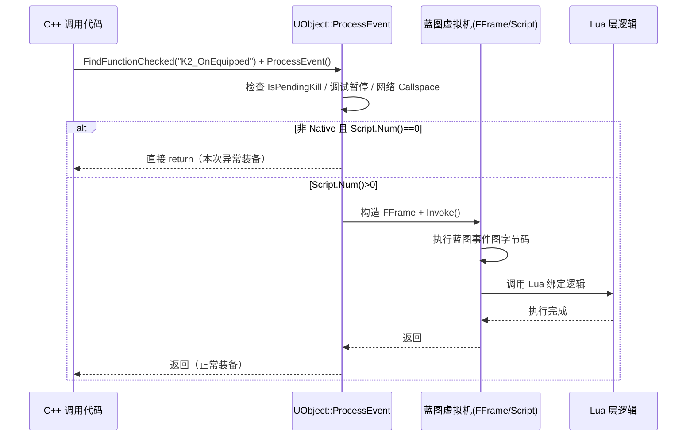

# 整体回顾

- 这次问题表象是：**同一套流程下，大部分装备的 `K2_OnEquipped` 都能走到 Lua，只有个别装备不行**。  
- 最终靠在 `UObject::ProcessEvent` 里加日志，把“正常装备”和“异常装备”的执行路径对比出来，确认是 **UE 反射链路在“蓝图脚本层”就断掉了**：异常装备对应的 `UFunction` 是非 Native，但 `Script.Num() == 0`，所以在 C++ 里就提前 `return`，根本没机会进入蓝图和 Lua。


---

### Bug 现象 & 关键日志差异

- **异常装备**：`ChestPVE_4930036_Instance_C`
  - 日志里我们看到：
    ```text
    [MOE] ProcessEvent Enter Obj=ChestPVE_4930036_Instance_C ...
    [MOE] ProcessEvent EarlyReturn: NonNative Script.Num==0 Obj=ChestPVE_4930036_Instance_C ...
    ```
  - 说明：
    - 进了 `UObject::ProcessEvent`；
    - 没有走任何 `IsPendingKill`、调试暂停、网络 Callspace 等分支；
    - **直接命中了 `else if (Function->Script.Num() == 0) return;` 这个早退**。

- **正常装备**：`ChestPVE_4930003_Instance_C`
  - 日志完整地打印了：
    ```text
    [MOE] ProcessEvent Enter ...
    [MOE] ProcessEvent After EnterScriptContext ...
    [MOE] ProcessEvent Before Invoke ...
    [MOE] ProcessEvent After Invoke ...
    [MOE] ProcessEvent Before ExitScriptContext ...
    [MOE] ProcessEvent After ExitScriptContext ...
    ```
  - 说明正常装备的 `K2_OnEquipped`：
    - 非 Native；
    - `Script.Num() > 0`，有蓝图字节码；
    - 成功执行了 `EnterScriptContext`、`Function->Invoke(...)`、`ExitScriptContext`，自然能走到蓝图里的逻辑，再到 Lua。

**结论（跟你一开始直觉不一样的点）：**  
真正拦住 Lua 的不是后面的 `FBlueprintContextTracker` 或 runaway，而是 **`Function->Script.Num() == 0`** 这一行——也就是说，这个异常装备对应的 `K2_OnEquipped` 从引擎视角看是“声明了，但没有任何脚本实现”。

---

### 重点：Lua / UE / 蓝图 / C++ 之间的调用链

这里用这次问题来反向梳理一下整个调用链，方便以后你一看日志就能定位问题出在那一层。

#### 1. C++ 层：调用入口

在你的项目里，大致是类似这样的调用：

```cpp
UFunction* Func = FindFunctionChecked(TEXT("K2_OnEquipped"));
ProcessEvent(Func, /*Parms=*/nullptr);
```

- `FindFunctionChecked("K2_OnEquipped")`：  
  通过 **反射系统** 从 `UClass` 的函数表里找到名字叫 `K2_OnEquipped` 的 `UFunction`。
- `ProcessEvent`：  
  这是所有“走反射的函数调用”的统一入口，不管后面接的是蓝图、脚本还是 C++ Native，都会先过这里。

#### 2. `UObject::ProcessEvent`：反射总调度

[ScriptCore.cpp](/C:/UGit/LetsGoDevelop/ue4_tracking_rdcsp/Engine/Source/Runtime/CoreUObject/Private/UObject/ScriptCore.cpp) 里的 `void UObject::ProcessEvent(UFunction* Function, void* Parms)` 做的事可以拆成几层：

1. **安全/环境检查**（我们的日志也印证都没触发）：
   - `IsUnreachable()` / `IsPendingKill()`：对象是否已被标记要销毁。
   - 编辑器断点暂停：`GIntraFrameDebuggingGameThread`。
   - 网络调用空间：`GetFunctionCallspace` + `CallRemoteFunction`，决定 RPC 在本地还是远程执行。

2. **判断是 Native 还是 Script：**
   - 如果 `Function->FunctionFlags & FUNC_Native`：
     - 先处理网络，再决定是否需要本地执行。
   - **否则走 Script 分支**：
     ```cpp
     else if (Function->Script.Num() == 0)
     {
         return; // 这次 bug 的核心
     }
     ```
     - **这里的 `Script` 就是蓝图/脚本对应的字节码数组**。  
     - `Script.Num() == 0` 对引擎来说等价于：“这个函数没有任何脚本实现（蓝图没实现事件，或者实现被某种原因清掉了）”，所以直接返回。

   在这一步，我们就看到了问题：  
   - 正常装备：`Script.Num() > 0`，能走到后面的 VM；  
   - 异常装备：`Script.Num() == 0`，在这儿被提前 `return`，**连蓝图 VM 都没进去，更不用说 Lua**。

3. **准备执行上下文（脚本帧）**：
   - 分配一个 `Frame`（可能是 UberGraph 持久帧，也可能是临时栈帧）。
   - `FMemory::Memcpy(Frame, Parms, Function->ParmsSize)` 把参数拷过去。
   - 组装 `FFrame NewStack(this, Function, Frame, NULL, Function->ChildProperties)`：
     - `NewStack` 就是蓝图虚拟机解释字节码的“执行栈帧”，包含当前 `UObject`、`UFunction`、局部变量、参数等信息。
   - 按 `CPF_OutParm` 等构建 `FOutParmRec` 链表，用来在脚本执行完后把 out 参数拷回调用者。

4. **调用入口：`Function->Invoke(this, NewStack, ReturnValueAddress)`**
   - 对 **非 Native 蓝图函数**（这次就是这种），`Invoke` 最终会走到 `ProcessLocalScriptFunction`，按 `Function->Script` 里的字节码一步步解释执行。
   - 你项目中 Lua 的逻辑，一般是挂在这条蓝图事件上——比如蓝图事件图里有“转发到 Lua”的节点/函数调用，所以 **只有蓝图 VM 跑起来，你的 Lua 才会被调用**。

5. **销毁局部变量 & 处理返回值**：
   - `DestructorLink` 链表，针对非参数的局部变量调用 `DestroyValue_InContainer`。
   - 对 constructed value 参数，把值拷回 `Parms`。

#### 3. 蓝图层：事件图 & Lua 绑定

这次的现象说明：

- 对**正常装备**：
  - `K2_OnEquipped` 的 `UFunction` 满足：
    - 非 Native；
    - `Script.Num() > 0`；
  - 蓝图事件图存在、字节码正常；
  - 蓝图事件图里应该有“调用到 Lua”的节点或 C++ bridge 函数，于是**Lua 逻辑能被触发**。

- 对**异常装备**：
  - 同名 `K2_OnEquipped` 能被 `FindFunctionChecked` 找到（说明声明是存在的）；
  - 但 `Script.Num() == 0`：
    - 蓝图侧要么没有实现 `K2_OnEquipped` 事件；
    - 要么实现被某种继承/重定向/asset 问题“吃掉”了，导致最终生成的 `UFunction` 没有字节码；
  - 结果：**蓝图 VM 根本没运行**，Lua 的转发逻辑完全没机会执行。

换一个角度讲这条链：



这次 bug 的本质就是：**这条链在 UE→BPVM 这一段就断了**。

---

### FBlueprintContextTracker 那一段小插曲

- 你在调试器里看到：走到  
  ```cpp
  FBlueprintContextTracker& BlueprintContextTracker = FBlueprintContextTracker::Get();
  ```  
  一步步单步时，调试器好像“从这里直接跳到函数结尾”，让人误以为是在 `FBlueprintContextTracker` 里被拦截。
- 我们尝试去打印 `BlueprintContextTracker.bRanaway`、`Recurse`、`Runaway` 等字段来验证“是否触发了 runaway 保护”，结果编译器报了 `C2248`：
  - 这些成员是 `FBlueprintContextTracker` 的 `private` 字段，外部文件无法直接访问。
- 最终通过日志对比确认：**这次根本没走到真正的蓝图执行那一步，更谈不上 runaway**，所以此路就作为一次“旁支探索”记下即可。

不过这次也顺带记住了一点：  
- 如果未来真的遇到“蓝图陷入死循环 / runaway”问题，调试姿势应该是：
  - 在 `ProcessLocalScriptFunction` 里打日志；
  - 看 `bRanaway` 是在哪个函数/哪条路径被置位；
  - 而不是在 `ProcessEvent` 外层强行访问私有字段。

---

### 这次排查带来的经验

- **定位 Lua 不执行时，别只盯 Lua**：  
  先从 **C++ → UE 反射 → 蓝图 VM → Lua** 这一整条链来找“断层”，这次就是断在 `Script.Num() == 0`。

- **对比正常 / 异常实例的日志非常关键**：  
  单看异常实例，只知道“没进 Lua”；  
  一旦和正常实例的 `ProcessEvent` 路径一对照，马上就能看到：
  - 哪个关口（哪条 `return`）被命中；
  - 哪个关口从来没被命中。

- **看到 `Script.Num() == 0`，优先回到资产层检查**：
  - 蓝图是否真的实现了对应事件；
  - 继承链是否一致；
  - 是否有 override、重定向或者 asset 配置导致最终类上的 `K2_OnEquipped` 没有脚本。

- **日志位置选得好，远比单步调试可靠**：  
  尤其在经过优化、行号对不上时，直接信“单步到哪儿”很容易误判；  
  这次在 `ProcessEvent` 所有 `return` 前加上带关键字段的 `UE_LOG`，就非常清晰地把真实执行路径呈现出来了。

---

如果你后面想继续深挖这条链，我们可以下一步专门对比一下 **异常装备蓝图** 和 **正常装备蓝图** 的继承关系、`K2_OnEquipped` 实现方式，把“为什么它会变成 `Script.Num()==0`”这件事也彻底掰开。


重点在于：不能找到Lua 脚本，说明不是同一个类，因为UFUNCTION和CLASS 相关，通过反射找的都是通过CLASS；并且已知其他可以正确运行；唯独这一个不行，可以确定问题在资产上